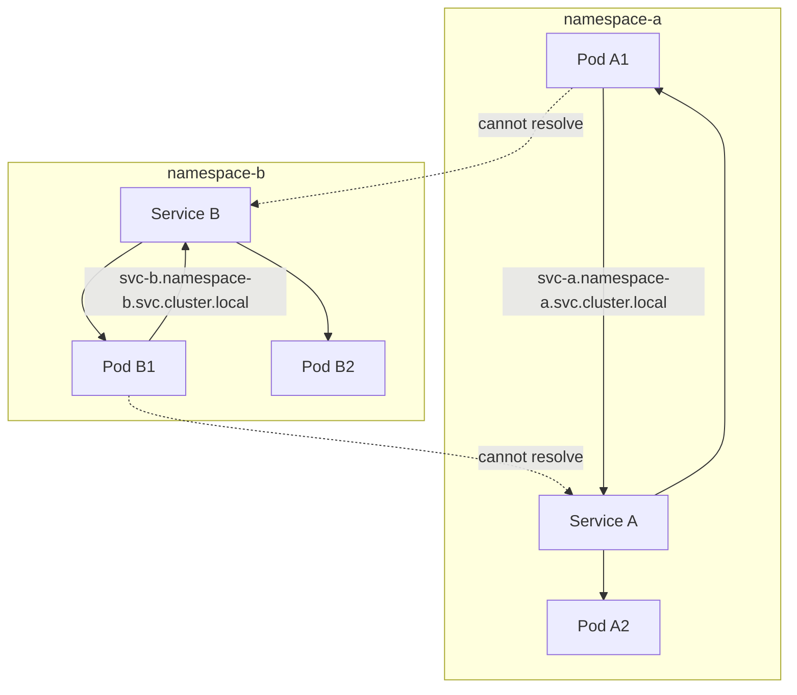
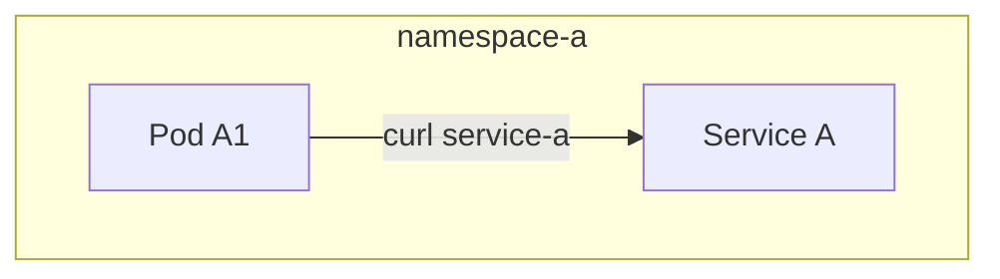
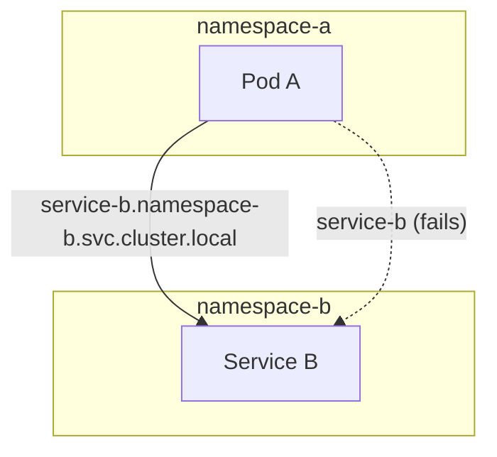
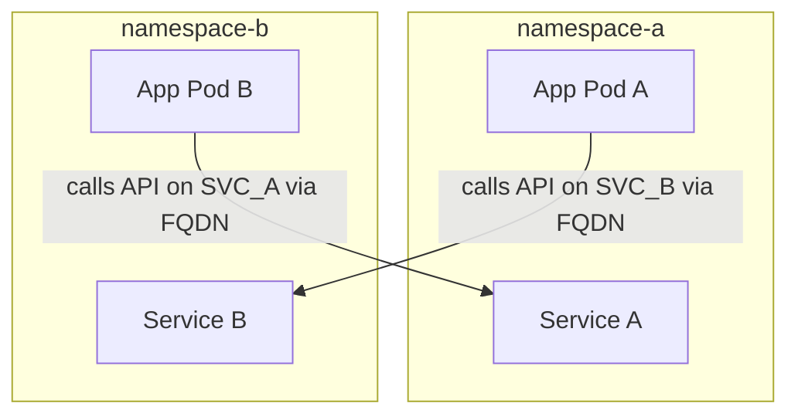

# Kubernetes Deployments – CKA Practice Guide

---

## 1. Creating Deployments

### 1.1 Imperative (Command-based) – Dry-run + YAML

```bash
kubectl create deployment myapp \
  --image=nginx \
  --replicas=3 \
  --dry-run=client -o yaml > myapp.yaml
```

---

## 2. Namespaces Overview

Namespaces logically isolate resources inside a cluster, allowing clean separation of environments, teams, or applications.

### Why Namespaces Matter

* Separate dev/stage/prod
* Avoid naming conflicts
* Apply RBAC per namespace
* Apply resource quotas
* Services resolve differently across namespaces

---

## 3. Namespace Diagram (Mermaid)



---

## 4. Accessing Resources Inside a Namespace

```bash
kubectl config set-context --current --namespace=namespace-a
```

List everything in the namespace:

```bash
kubectl get all
```

---

## 5. Deleting Resources

Delete all deployments in current namespace:

```bash
kubectl delete deployments --all
```

Delete all resources (pods, deployments, services, rs, etc.) in a namespace:

```bash
kubectl delete all --all -n namespace-a
```

---

## 6. Pod-to-Service Access (Same Namespace)

Pods inside a namespace can resolve services **without FQDN** using only the service name.

Example (namespace `namespace-a`):

```bash
curl http://service-a
```

Kube-DNS automatically resolves:

```
service-a.namespace-a.svc.cluster.local
```

### Mermaid Diagram



---

## 7. Cross-Namespace Service Access

By default, pods **cannot** access another namespace's service using short name.
They MUST use the **fully-qualified domain name (FQDN)**.

FQDN pattern:

```
<service>.<namespace>.svc.cluster.local
```

Example: A pod in `namespace-a` calling a service in `namespace-b`:

```bash
curl http://service-b.namespace-b.svc.cluster.local
```

### Mermaid Diagram



---

## 8. Service-to-Service Access

Services don't directly call other services — **pods call services**.
But we can model how applications in one namespace consume functionality from another namespace.

### Concept Diagram



---

## 9. Summary of Access Rules

### Same Namespace

* Access using short name: `http://service-a`

### Cross Namespace

* Must use FQDN:

```
service-b.namespace-b.svc.cluster.local
```

### Pods ONLY

* Pods call services
* Services never call services directly

### If You Want to Block Cross-Namespace Access

Use **NetworkPolicies**.

---
